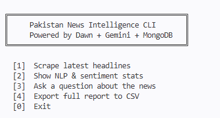

# Scrapi



A production-grade web scraper that collects Pakistani news headlines,
enriches them with NLP, and stores structured data in MongoDB Atlas.

---

## What It Does

- Scrapes Dawn News using headless Playwright browser
- Rotates User-Agents on every request to bypass bot detection
- Cleans and deduplicates data using Pandas
- Stores enriched documents permanently in MongoDB Atlas
- Runs daily — skips already-stored headlines automatically

---

## Tech Stack

| Tool | Purpose |
|---|---|
| Playwright | Headless browser scraping |
| BeautifulSoup | HTML parsing |
| Fake UserAgent | Anti-bot identity rotation |
| Pandas | Data cleaning and deduplication |
| MongoDB Atlas | Permanent cloud storage |

---

## Output — Each Document Stored

```json
{
  "text": "PM Shehbaz chairs federal cabinet meeting",
  "url": "/news/1234567",
  "source": "Dawn",
  "scraped_at": "2026-06-25"
}
```

---

## Setup

```bash
git clone https://github.com/muhammad-asif10/Scrapi
cd news-scraper
pip install -r requirements.txt
playwright install chromium
```

Create a `.env` file:
```bash
MONGO_URI='your string'
GEMINI_API_KEY='your api key'
```

Run:
```bash
python scraper.py
```

---

## requirements.txt
```bash
playwright
fake_useragent
nltk
sentence_transformers
bs4
pymongo
google-generativeai
spacy
numpy
pandas
dotenv
```